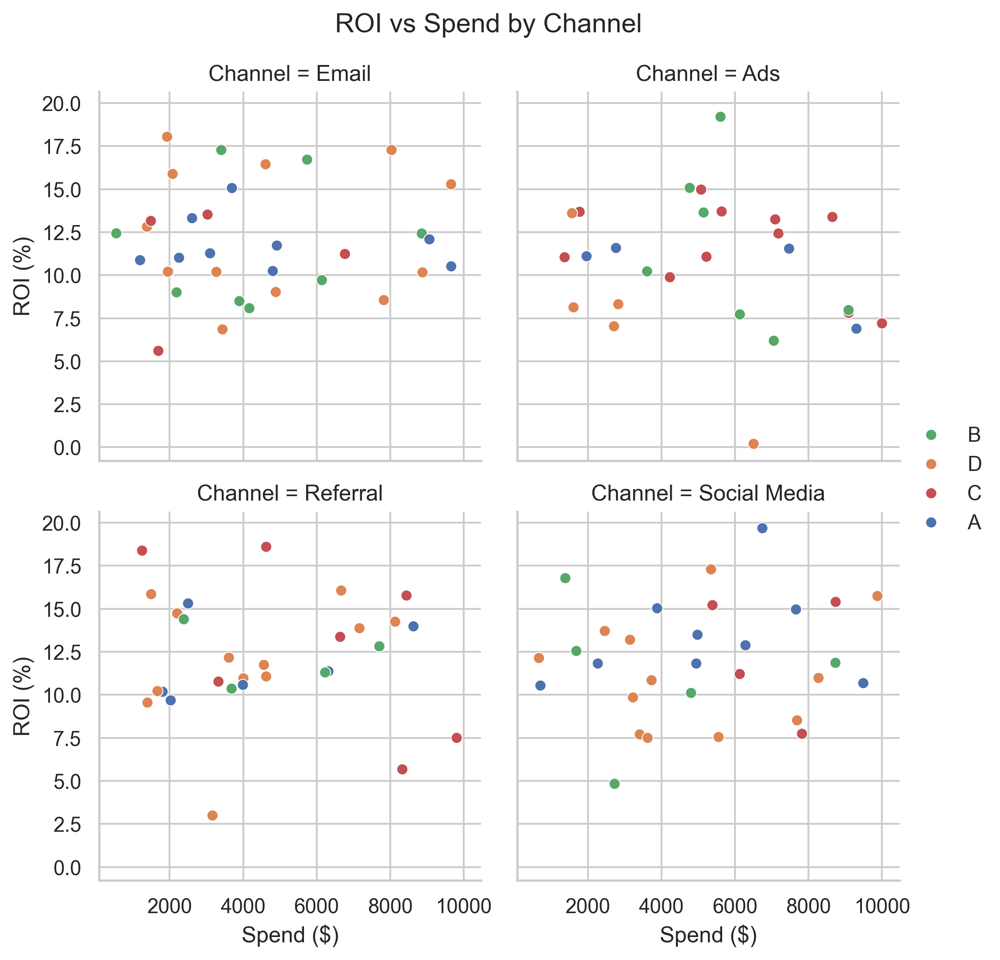
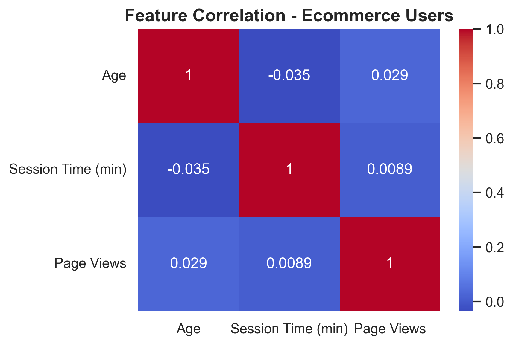

# 🎨 SeabornMasterPro

[](https://www.gnu.org/licenses/gpl-3.0)
[](https://www.python.org/)
[](https://jupyter.org/)
[](https://seaborn.pydata.org/)
[](https://www.docker.com/)
[](https://streamlit.io/)
[](https://github.com/SatvikPraveen/SeabornMasterPro/pulls)
[](https://github.com/SatvikPraveen/SeabornMasterPro/commits)

---

## 📌 Overview

**SeabornMasterPro** is an open-source, end-to-end visualization mastery project built to help you **learn, recall, and reuse** Seaborn effectively — from plotting basics to dashboard-level visual storytelling.

🎯 Ideal for:

- Learners who want structured notebooks and projects
- Practitioners who want reusable utilities and themes
- Professionals who need dashboards, cheatsheets, and reproducible setups

---

## 📽️ Project Preview

Here’s a glimpse into the Seaborn visualizations and dashboards created in this project:

### 🧭 Streamlit EDA Dashboard

> Powered by `streamlit_app.py`, this dashboard provides real-time interaction with synthetic datasets.



---

### 📊 Real-World Visual Storytelling

> Plots generated using `notebooks/05_realworld_EDA.ipynb` and reusable functions from `plot_utils.py`.



---

## 🧠 Learning Outcomes

By working through this project, you'll be able to:

- 📊 Visualize structured data with Seaborn’s full plotting suite
- 🧱 Build custom dashboards using Streamlit and save visual reports
- ♻️ Reuse plot components using `plot_utils.py`
- 📦 Package everything in a container-ready environment

---

## 🧱 Project Structure

```bash
SeabornMasterPro/
├── notebooks/               # Comprehensive coverage (10 notebooks)
│   ├── 01_setup_and_basics.ipynb
│   ├── 02_distributions_relationships.ipynb
│   ├── 03_categorical_matrixplots.ipynb
│   ├── 04_multi_custom_dashboards.ipynb
│   ├── 05_realworld_EDA.ipynb
│   ├── 06_timeseries_lineplots.ipynb
│   ├── 07_figure_level_functions.ipynb
│   ├── 08_advanced_categorical.ipynb
│   ├── 09_styling_customization.ipynb
│   └── 10_statistical_parameters.ipynb
├── utils/                   # Enhanced utility functions
│   └── plot_utils.py        # 12 functions: themes, export, palettes, grids, annotations
├── scripts/                 # Dataset generators and helpers
│   └── generate_datasets.py
├── datasets/                # Synthetic datasets (auto-generated)
│   ├── ecommerce_data.csv
│   ├── employee_data.csv
│   ├── marketing_campaign.csv
│   ├── sales_data.csv
│   ├── student_scores.csv
│   └── web_traffic.csv
├── exports/                 # Saved visuals for all 10 notebooks
│   ├── 01_setup/ ... 06_timeseries/
│   ├── 07_figure_level/
│   ├── 08_categorical/
│   ├── 09_styling/
│   └── 10_statistical/
├── docs/                    # Comprehensive documentation
│   ├── best_practices.md
│   ├── plot_comparison.md
│   ├── troubleshooting.md
│   └── feature_matrix.md
├── tests/                   # Testing infrastructure
│   ├── __init__.py
│   └── test_plot_utils.py
├── .github/                 # GitHub templates and workflows
│   ├── workflows/
│   │   └── test.yml
│   ├── ISSUE_TEMPLATE/
│   └── PULL_REQUEST_TEMPLATE.md
├── cheatsheets/             # Markdown cheatsheets
│   └── seaborn_cheatsheet.md
├── streamlit_app.py         # Interactive dashboard (all 10 notebooks)
├── setup.py                 # Package installation
├── pytest.ini               # Test configuration
├── requirements.txt         # Minimal dependencies
├── requirements_dev.txt     # Full dev environment
├── Dockerfile               # Container setup
├── .dockerignore
├── .gitignore
├── README.md
└── LICENSE
```

---

## 🌟 Features

- 📘 **10 comprehensive notebooks** covering all Seaborn functionality
- 📊 **100% Seaborn coverage**: All 30+ core functions including `relplot`, `displot`, `catplot`, `jointplot`, `lmplot`, `FacetGrid`, and more
- 🎯 **Figure-level vs Axes-level** paradigm explained in depth
- 📊 **Advanced categorical plots**: `barplot` with custom estimators, statistical comparisons
- 🎨 **Styling mastery**: Color theory, palettes (sequential/diverging/qualitative), themes
- 📐 **Statistical parameters**: Deep dive into `estimator` and `errorbar` options
- ♻️ **Enhanced utilities**: 12 reusable functions in `plot_utils.py`
- 📚 **Comprehensive docs**: Best practices, plot comparison guide, troubleshooting, feature matrix
- 🧪 **Testing infrastructure**: pytest with CI/CD via GitHub Actions
- 📁 Exports saved with `save_fig()` into logical folders
- 🗂️ Cheatsheet in Markdown for quick revision
- 🌐 Streamlit dashboard to explore all visualizations interactively
- 🐳 Docker support for full reproducibility
- 📦 **Pip-installable**: `pip install -e .`

---

## ✅ Mastery Checklist

- [x] Setup environment and install dependencies
- [x] Master Seaborn basics, distributions, relationships
- [x] Learn categorical & matrix visualizations
- [x] Build dashboards and multi-panel plots
- [x] Analyze real-world synthetic datasets
- [x] Master figure-level functions (relplot, displot, catplot, lmplot, jointplot)
- [x] Understand axes-level vs figure-level paradigm
- [x] Learn advanced categorical plots (barplot with custom estimators)
- [x] Master styling and customization (themes, palettes, color theory)
- [x] Understand statistical parameters (estimator, errorbar options)
- [x] Use `.pipe()` and enhanced `plot_utils.py` for reusability
- [x] Run comprehensive tests with pytest
- [x] Explore all visualizations via Streamlit dashboard
- [x] Run everything inside Docker for reproducibility

---

## 🔧 Setup Instructions

### ▶️ Install Requirements

```bash
pip install -r requirements.txt
```

Or using Conda:

```bash
conda create -n seabornpro python=3.10
conda activate seabornpro
pip install -r requirements.txt
```

---

## 🐳 Run in Docker (JupyterLab)

```bash
docker build -t seaborn-masterpro .
docker run -p 8890:8888 -p 8501:8501 -v $(pwd):/app -d seaborn-masterpro
```

You can now open JupyterLab in your browser at:
🔗 [http://localhost:8890](http://localhost:8890)

> The container disables Jupyter token/password prompts for local ease.

---

## 📊 Launch Streamlit Dashboard

```bash
streamlit run streamlit_app.py
```

Then visit:
🔗 [http://localhost:8501](http://localhost:8501)

---

## 🔁 Extend This Repo

Want to take this further?

- [ ] Add Plotly/Altair interactive options
- [ ] Create animated visualizations
- [ ] Create `seaborn_themes.py` presets for custom themes
- [ ] Add more interactive controls to Streamlit dashboard
- [ ] Add benchmarking and performance comparisons
- [ ] Create video tutorials for each notebook

---

## 🧠 Learn by Doing

Each notebook is carefully structured with:

- ✅ Concepts grouped by theme
- ✅ Code + plots + comments inline
- ✅ Modular reusability via `plot_utils.py`
- ✅ Dataset links and exports
- ✅ Time-based, categorical, and real-world examples

---

## 📌 Topics Covered

### Core Notebooks
- **01**: Setup and Seaborn basics
- **02**: Distributions and pairwise relationships
- **03**: Categorical plots and matrix visualizations
- **04**: Multi-panel layouts and custom dashboards
- **05**: Real-world EDA with Titanic & Marketing Campaign
- **06**: Advanced time series (multi-series, confidence intervals, seasonality)

### Advanced Notebooks
- **07**: Figure-level functions (relplot, lmplot, jointplot, displot)
- **08**: Advanced categorical plots (barplot with custom estimators)
- **09**: Styling & customization (color theory, palettes, themes)
- **10**: Statistical parameters (estimator, errorbar deep dive)

### Documentation
- Best practices for data visualization
- Plot comparison and decision guide
- Troubleshooting common issues
- Complete feature matrix and coverage map

---

## 🎯 Who Is This For?

| Level           | Use Case                        |
| --------------- | ------------------------------- |
| ✅ Beginner     | Learn Seaborn from scratch      |
| ✅ Intermediate | Build reusable pipelines        |
| ✅ Advanced     | Automate dashboards with Docker |

---

## 🔗 Related Projects

- 🧠 [NumPyMasterPro](https://github.com/SatvikPraveen/NumPyMasterPro) — Deep dive into NumPy fundamentals
- 🐼 [PandasPlayground](https://github.com/SatvikPraveen/PandasPlayground) — Data cleaning and EDA workflows

---

## 📄 License

This project is licensed under the [GNU General Public License v3.0](https://www.gnu.org/licenses/gpl-3.0). See the [LICENSE](./LICENSE) file for more details.

---

## 🙌 Acknowledgements

- [Seaborn](https://seaborn.pydata.org/)
- [Matplotlib](https://matplotlib.org/)
- [Streamlit](https://streamlit.io/)
- [Python](https://www.python.org/)

---

## ✨ Author

Made with 💙 by [Satvik Praveen](https://github.com/SatvikPraveen)

---
