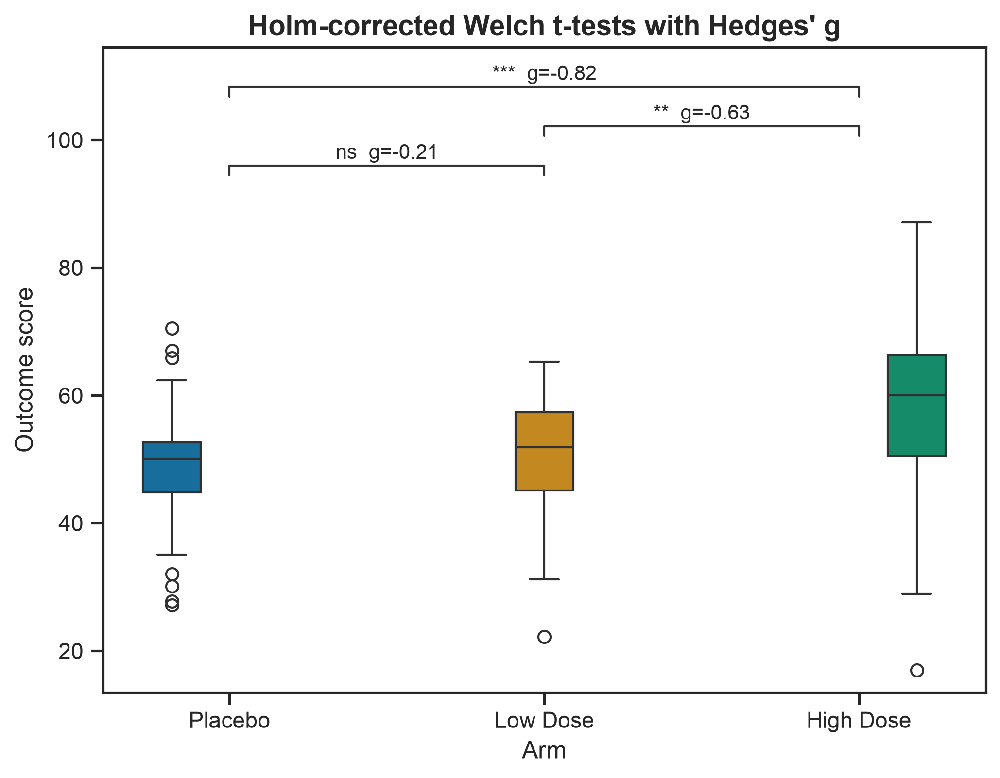
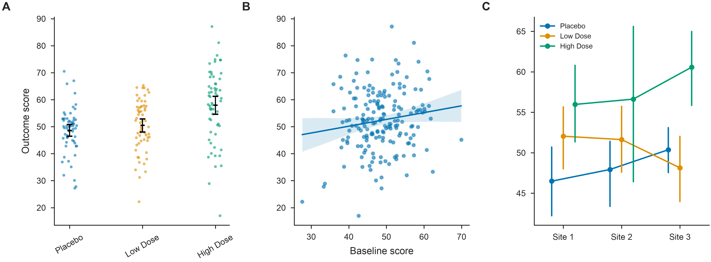

# 🎨 SeabornMasterPro

**Research-grade statistical visualization on top of Seaborn: a typed package, an eleven-notebook curriculum, and a reproducible figure pipeline.**

[](https://github.com/SatvikPraveen/SeabornMasterPro/actions/workflows/ci.yml)
[](https://www.gnu.org/licenses/gpl-3.0)
[](https://www.python.org/)
[](https://seaborn.pydata.org/)
[](https://peps.python.org/pep-0561/)
[](https://github.com/astral-sh/ruff)
[](CITATION.cff)
[](https://github.com/SatvikPraveen/SeabornMasterPro/commits)

---

## 📌 What this is

Seaborn draws excellent statistical graphics. Getting one of them into a paper still means
answering questions Seaborn does not: *What is the confidence interval, numerically? How big is
the effect? Are the p-values corrected? Can a colour-blind reviewer read the legend? Is the figure
the right width for the journal? Which commit produced it?*

**SeabornMasterPro** answers those questions in code:

| Need | Module | Key functions |
|---|---|---|
| Uncertainty you can cite | `stats` | `bootstrap_ci` (percentile / basic / BCa), `group_summary` |
| Effect sizes, not just stars | `stats` | `cohens_d`, `hedges_g`, `glass_delta`, `cliffs_delta`, `interpret_effect_size` |
| Corrected pairwise tests | `stats` | `compare_groups` (Welch / Student / Mann–Whitney / permutation × Bonferroni / Holm / FDR) |
| Brackets and labels | `annotate` | `annotate_pairwise`, `annotate_effect_sizes`, `add_statistical_annotations` |
| Accessible palettes | `color` | `validate_palette`, `simulate_cvd` (Machado 2009), `delta_e`, `contrast_ratio` (WCAG 2.1) |
| Venue geometry | `theme` | `journal_context`, `figsize_for`, `publication_rc` for Nature, Science, IEEE, Elsevier, PLOS, ACM |
| Provenance in the file | `io` | `save_fig`, `save_publication_figure` embed versions + git revision in PNG/PDF/SVG |
| Reproducibility | `repro` | `set_seed`, `capture_environment`, `write_manifest`, `verify_manifest` |
| Data with data cards | `datasets` | `REGISTRY`, `load`, `generate_all`, `smp-datasets` CLI |
| Performance | `benchmark` | `run_benchmark`, `plot_benchmark`, `smp-benchmark` CLI |

The estimators and their references are documented in [`docs/methodology.md`](docs/methodology.md);
the full signatures are in [`docs/api_reference.md`](docs/api_reference.md).

---

## 🚀 Quick start

```bash
git clone https://github.com/SatvikPraveen/SeabornMasterPro.git
cd SeabornMasterPro
pip install -e ".[all]"        # package + notebooks + Streamlit + Excel export
```

```python
import seaborn as sns
import matplotlib.pyplot as plt
import seabornmasterpro as smp
from seabornmasterpro import annotate, datasets, stats, theme

rng = smp.set_seed(2024)
trial = datasets.load("clinical_trial")                      # documented synthetic RCT
arms = ["Placebo", "Low Dose", "High Dose"]

results = stats.compare_groups(trial, "Arm", "Outcome", test="welch", correction="holm", order=arms)
print(results[["group_a", "group_b", "p_adjusted", "effect_size", "effect_label", "stars"]])

with theme.journal_context("nature", columns=1):
    fig, ax = plt.subplots()
    sns.boxplot(data=trial, x="Arm", y="Outcome", order=arms, hue="Arm", legend=False, ax=ax)
    annotate.annotate_pairwise(ax, results, order=arms, show_effect=True)
    smp.save_publication_figure(fig, "exports/figure1", formats=("png", "pdf"))   # provenance embedded
```

```
   group_a   group_b  p_adjusted  effect_size effect_label stars
0  Placebo  Low Dose      0.2530      -0.2084        small    ns
1  Placebo High Dose      0.0000      -0.8245        large   ***
2 Low Dose High Dose      0.0014      -0.6350       medium    **
```



---

## 🔬 The research workflow (Notebook 11)

[`notebooks/11_research_workflow.ipynb`](notebooks/11_research_workflow.ipynb) runs a complete
analysis from data card to submission-ready figure:

1. Read the **data card** and load `clinical_trial`, which plants a known effect (Cohen's *d* ≈ 0.78).
2. Estimate group means with **bootstrap confidence intervals** and print them under the plot.
3. Run **Holm-corrected Welch tests** and stack significance brackets with Hedges' *g*.
4. Check the conclusion survives **Mann–Whitney and permutation** tests.
5. **Recover the planted effect** with a bootstrap interval around *d*.
6. Validate palettes under **simulated colour-vision deficiency** and WCAG contrast.
7. Export a **Nature double-column, three-panel figure** as PNG/PDF/SVG with provenance metadata, then read the metadata back.
8. Plot hourly sensor data with **labelled anomalies**, and a **clustered expression heatmap**.
9. **Verify the dataset manifest** before trusting any of it.



---

## 📘 Curriculum

| # | Notebook | Level | Covers |
|---|---|---|---|
| 01 | Setup & basics | Beginner | themes, `histplot`, `scatterplot`, `boxplot` |
| 02 | Distributions & relationships | Beginner | `kdeplot`, `ecdfplot`, `regplot`, `residplot` |
| 03 | Categorical & matrix plots | Intermediate | `violinplot`, `swarmplot`, `heatmap`, `clustermap` |
| 04 | Multi-panel dashboards | Intermediate | `pairplot`, `FacetGrid`, `catplot`, custom grids |
| 05 | Real-world EDA | Intermediate | missingness, correlation, segmentation |
| 06 | Time series | Intermediate | multi-series, error bands, rolling statistics, seasonality |
| 07 | Figure-level functions | Advanced | `relplot`, `displot`, `lmplot`, `jointplot` |
| 08 | Advanced categorical | Advanced | estimators, `errorbar`, grouped bars |
| 09 | Styling & customization | Advanced | palettes, colour theory, contexts |
| 10 | Statistical parameters | Advanced | `estimator` / `errorbar` internals, bootstrap |
| 11 | **Research workflow** | Research | CIs, effect sizes, corrections, CVD, journal export, provenance |

Every notebook is executed in CI (`pytest -m notebooks`). Figures are saved to `exports/NN_*/`.
The full feature map is in [`docs/feature_matrix.md`](docs/feature_matrix.md).

---

## 🗂 Datasets with data cards

`datasets/` holds nine synthetic tables. Each has a `DatasetCard` stating its generative model,
column roles and seed, and `datasets/MANIFEST.json` records a SHA-256 for every file plus the
environment that produced it.

```bash
smp-datasets --list          # print the data cards
smp-datasets                 # regenerate CSVs + manifest (bit-for-bit)
```

| Dataset | Rows | Ground truth |
|---|---|---|
| `clinical_trial` | 180 | Placebo vs High Dose *d* ≈ 0.78; Placebo vs Low ≈ 0.33 |
| `sensor_readings` | 8 640 | diurnal + weekly + drift components, 0.4 % labelled anomalies |
| `gene_expression` | 40 × 24 | two modules shifted +1.8 / −1.2 log₂ in treated samples |
| `sales_data`, `employee_data`, `student_scores`, `ecommerce_data`, `marketing_campaign`, `web_traffic` | 100–200 | legacy tables, regenerated from the original seed |

CI regenerates the datasets and fails if a single byte differs.

---

## 🧱 Project structure

```
SeabornMasterPro/
├── seabornmasterpro/         # typed package (py.typed)
│   ├── stats.py              # bootstrap, effect sizes, corrected pairwise tests
│   ├── color.py              # CVD simulation, ΔE, WCAG contrast, palette reports
│   ├── theme.py              # journal presets, rc contexts
│   ├── io.py                 # figure/data export with provenance
│   ├── annotate.py           # brackets, labels, reference lines
│   ├── layout.py             # grids, panel labels, date axes
│   ├── repro.py              # seeding, environment capture, manifests
│   ├── datasets.py           # registry, data cards, generators, CLI
│   └── benchmark.py          # timing harness, CLI
├── notebooks/                # 11 notebooks (01–10 curriculum, 11 research workflow)
├── examples/                 # 7 CLI scripts built on the package
├── datasets/                 # CSVs + MANIFEST.json
├── exports/                  # figures produced by the notebooks
├── docs/                     # methodology, API reference, best practices, troubleshooting
├── tests/                    # unit, property-based, app and notebook tests
├── utils/plot_utils.py       # backward-compatible facade for older imports
├── streamlit_app.py          # interactive research explorer
├── scripts/                  # dataset regeneration, API-reference builder
├── .github/workflows/ci.yml  # lint, types, 12-way test matrix, repro checks, notebooks, build
├── pyproject.toml            # packaging + ruff + mypy + pytest + coverage config
├── CITATION.cff
└── Dockerfile
```

---

## 🧪 Quality gates

```bash
pip install -e ".[all,dev]" && pre-commit install
ruff check . && ruff format --check .      # lint + format
mypy                                       # types (package is py.typed)
pytest                                     # 130+ unit and Hypothesis property tests
pytest -m notebooks                        # execute all 11 notebooks
```

CI runs all of the above on Ubuntu, macOS and Windows for Python 3.10–3.13, regenerates the
datasets byte-for-byte, verifies the manifest, runs every example script with
`-W error::FutureWarning`, executes the notebooks, and builds the wheel.

---

## 🖥 Apps and scripts

**Streamlit explorer**

```bash
streamlit run streamlit_app.py
```

Tabs: figure gallery per notebook · dataset cards with interactive plots · group comparison with
corrected tests and brackets · palette accessibility checker · environment and manifest status.

**Command-line examples** (`examples/`, see its [README](examples/README.md))

```bash
python examples/statistical_viz.py --output exports/examples/stats
python examples/publication_figures.py --size nature --formats pdf svg
python examples/batch_processing.py --parallel
python examples/reusable_template.py --data datasets/sales_data.csv --heatmap
```

**Benchmarks**

```bash
smp-benchmark --sizes 100 1000 10000 --repeats 5 --out benchmarks/results
```

---

## 🐳 Docker

```bash
docker build -t seaborn-masterpro .
docker run -p 8888:8888 -p 8501:8501 seaborn-masterpro                 # JupyterLab at :8888
docker run -p 8501:8501 seaborn-masterpro streamlit run streamlit_app.py --server.address 0.0.0.0
docker run seaborn-masterpro pytest -q
```

---

## 📖 Documentation

- [`docs/methodology.md`](docs/methodology.md): every estimator, its definition, reference and tests
- [`docs/api_reference.md`](docs/api_reference.md): generated API reference
- [`docs/best_practices.md`](docs/best_practices.md), [`docs/plot_comparison.md`](docs/plot_comparison.md), [`docs/troubleshooting.md`](docs/troubleshooting.md), [`docs/feature_matrix.md`](docs/feature_matrix.md)
- [`cheatsheets/seaborn_cheatsheet.md`](cheatsheets/seaborn_cheatsheet.md)
- [`CHANGELOG.md`](CHANGELOG.md), [`CONTRIBUTING.md`](CONTRIBUTING.md)

---

## 📝 Citing

If this project supports your research, please cite it via [`CITATION.cff`](CITATION.cff)
(GitHub renders a "Cite this repository" button), and cite Seaborn itself:
Waskom, M. L. (2021). seaborn: statistical data visualization. *JOSS*, 6(60), 3021.

---

## 🔗 Related projects

- 🧠 [NumPyMasterPro](https://github.com/SatvikPraveen/NumPyMasterPro): NumPy fundamentals
- 🐼 [PandasPlayground](https://github.com/SatvikPraveen/PandasPlayground): data cleaning and EDA

---

## 📄 License

[GNU General Public License v3.0 or later](LICENSE).

## ✨ Author

Made with 💙 by [Satvik Praveen](https://github.com/SatvikPraveen)
