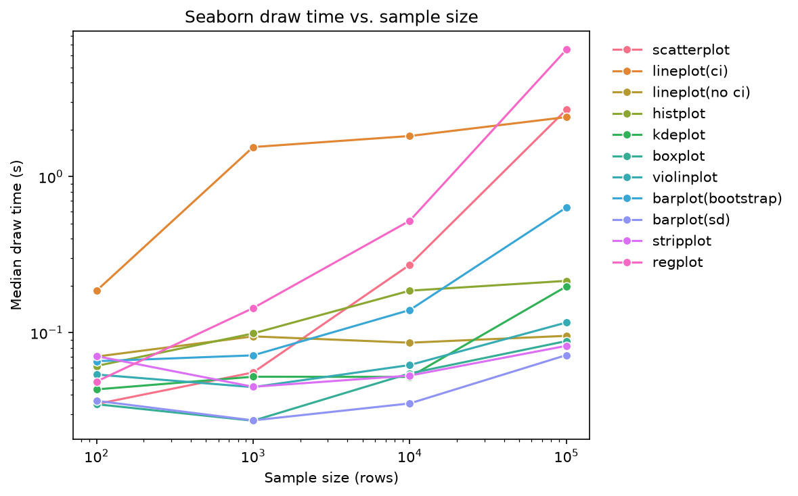

# Benchmarks

Wall-clock draw time (figure creation → `canvas.draw()`) of Seaborn axes-level
functions as a function of sample size. Produced with:

```bash
smp-benchmark --sizes 100 1000 10000 100000 --repeats 5 --out benchmarks/results
# or: python -m seabornmasterpro.benchmark ...
```

The harness lives in `seabornmasterpro/benchmark.py`; each case is timed after
one warm-up call, and the median of 5 repeats is reported (Q1/Q3/min are in the
CSV). Data are generated with `make_data(n, seed=0)`: four groups, `x ~ N(g, 1)`,
`y = 0.5x + N(0, 1)`, and a 50-level time index.

## Reference results

Apple Silicon laptop, Python 3.13, seaborn 0.13.2, matplotlib 3.11, pandas 3.0,
numpy 2.5, Agg backend. Median draw time in **milliseconds**.

| function | n=100 | n=1,000 | n=10,000 | n=100,000 |
|---|---:|---:|---:|---:|
| barplot(bootstrap) | 65.6 | 71.6 | 139.6 | 634.2 |
| barplot(sd) | 36.6 | 27.4 | 35.2 | 71.8 |
| boxplot | 34.8 | 27.3 | 54.8 | 88.4 |
| histplot | 61.2 | 98.9 | 185.8 | 214.8 |
| kdeplot | 43.3 | 52.2 | 52.1 | 197.8 |
| lineplot(ci) | 185.8 | 1546.9 | 1820.4 | 2406.6 |
| lineplot(no ci) | 70.3 | 94.7 | 86.2 | 95.4 |
| regplot | 48.6 | 143.8 | 521.5 | 6510.6 |
| scatterplot | 34.9 | 55.6 | 272.1 | 2687.3 |
| stripplot | 70.7 | 45.0 | 53.1 | 82.3 |
| violinplot | 53.9 | 44.8 | 62.0 | 116.1 |



## Observations

- **Bootstrapping dominates.** `lineplot` with its default 95 % bootstrap CI is
  16–25× slower than `errorbar=None` at n ≥ 1,000, and `barplot` with the
  default bootstrap is ~9× slower than `errorbar="sd"` at n = 100,000. Use
  `errorbar=("se", 1)`, `"sd"`, or a pre-aggregated frame for large data, and
  reserve bootstrapping for the final figure (with an explicit `seed`).
- **`regplot` is the worst scaler** (≈ 6.5 s at 100k rows) because it bootstraps
  the regression fit; pass `ci=None` or fit with statsmodels and draw the band
  yourself.
- **Point marks scale with n**; aggregate marks do not. `scatterplot` grows
  roughly linearly (2.7 s at 100k) whereas `boxplot`/`violinplot`/`stripplot`
  stay under ~120 ms because the cost is in the summary, not the marks. For
  large n prefer `histplot`/`kdeplot`/hexbin or `sns.scatterplot(..., s=2,
  alpha=0.1)` on a subsample.
- Timings below ~50 ms are dominated by matplotlib figure setup, not Seaborn.

Re-run the benchmark on your own hardware before quoting numbers; only the
*relative* ordering is expected to transfer across machines.
